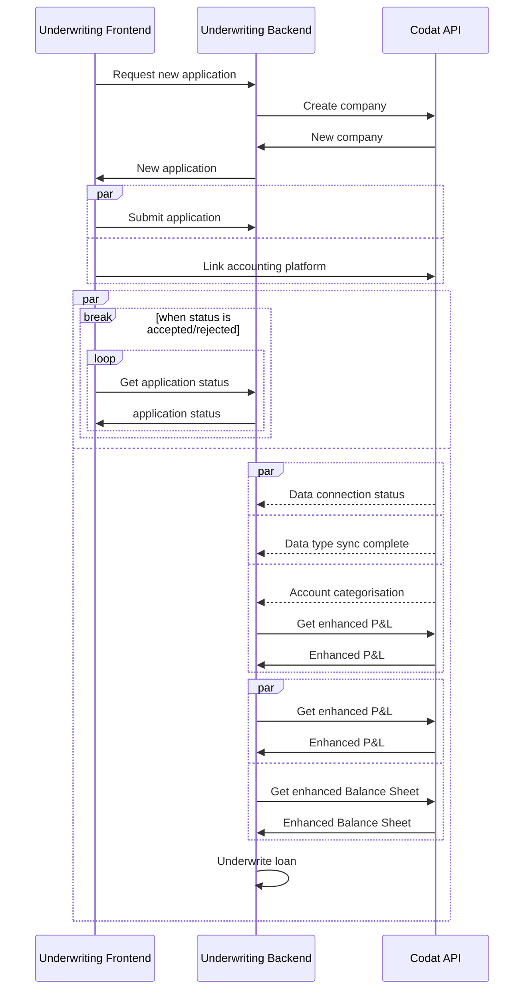

# demo-lending

## Introduction

This project shows how you can integrate Codat into an automated underwriting web application.
The project is implemented in [.NET 7.0](https://dotnet.microsoft.com/en-us/download/dotnet/7.0) as a backend API that uses features of Codat's [Assess](https://docs.codat.io/docs/assess-overview?utm_medium=referral&utm_source=linked_website&utm_campaign=2023_github_underwriting_code_demo) product.

You'll learn how to:
- Create a test Company via API.
- Use Codat's webhooks to trigger the underwriting of a loan.
- Access and create custom financial metrics using our enhanced Profit and Loss statement and enhanced Balance Sheet.

> NOTE: We use an example underwriting model to highlight how you can use Codat to fully automate a loan for SMBs.

## Prerequisites

You need these to run and test the code locally: 
- A Codat account that you can [create for free](https://signup.codat.io/?utm_medium=referral&utm_source=linked_website&utm_campaign=2023_github_underwriting_code_demo)
- Your Codat [API keys](https://app.codat.io/developers/api-keys?utm_medium=referral&utm_source=linked_website&utm_campaign=2023_github_underwriting_code_demo)
- A way to access remote systems from your locally hosted server (we used [ngrok](https://ngrok.com/))

## Getting started

To run the underwriting demo app: 
1. Add your API key (`CodatApiKey`) and local machine's publicly available base url (`BaseWebhookUrl`) to the `appSettings.json` file.
2. Start your local application.
3. Apply for a loan:
   1. Call `GET applications/start` to start a new loan application. This returns an application id and a `linkUrl`. 
   2. Use the application id to complete the form. Then, submit it using the `POST applications/form` endpoint.
   3. Link your test Company's accounting data using the `linkUrl`.
4. Call the `GET applications/{applicationId}` endpoint to view the status of the loan.

#### Request body of an example application form 
```json
{
   "id": "applicationId", 
   "companyName": "Example Company",
   "fullName": "John Smith",
   "loanAmount": 25000.00, // must be greater than zero 
   "loanTerm": 36, // must be at least 12 months
   "loanPurpose": "Growth marketing campaign."
}
```

## Implementing the solution

The underwriting model we use in the demo requires the following data about the company and the borrower:
- Validated application details
- Chart of accounts
- Balance sheet
- Profit and loss statement
- Classified accounts

We will now demonstrate how Codat enables you to access this data. It will help you undestand how you may implement your own automated underwriting solution.

Our example app contains several endpoints:
* Three public endpoints allow the prospective borrower request a new application, submit specific loan details, and retrieve an application via an imaginary front end.  
* Three webhook endpoints update the data requirements needed to underwrite the loan: the company's Balance Sheet, Profit & Loss statement, and a fully categorised Chart of Accounts.

Review the sequence diagram to visualize the steps performed by the app. We used solid arrows to depict public endpoints and dotted arrows for webhooks. 



### Applying for a loan

We begin when the prospect initiates a new loan application by calling the `application/start` endpoint. It returns an 
application id, which we then use as the company name to create a Company using Codat's `POST /companies` endpoint. 

This allows us to assign the application a reference in Codat's system, even though we don't have the Company name yet.
When the new Codat company is created, the company and application ids are stored, and then returned to the prospective borrower. 

We also store the date the application was created to use as a reference date later.

#### Example response returned by the `start` endpoint

```json
{
   "id": "1c727866-6923-4f81-aa7b-c7fd8c533586",
   "dateCreated": "2023-01-18T00:00:00Z",
   "codatCompanyId": "a9e28b79-6a98-4190-948d-3bd4d60e7c0a",
   "status": "Started", 
   "linkUrl": "https://link.codat.io/company/a9e28b79-6a98-4190-948d-3bd4d60e7c0a"
}
```

Once the prospective borrower receives the application and Codat company id, they should complete the application details and link their
accounting platform. They can: 
- Pass the `codatCompanyId` to [embedded link](https://docs.codat.io/docs/authorize-embedded-link?utm_medium=referral&utm_source=linked_website&utm_campaign=2023_github_underwriting_code_demo), or
- Use the `linkUrl`.


In the example app, we only request the borrower's full name, company name, and the loan amount, length and purpose. These details are posted to the `applications/forms` endpoint, which validates 
that the required fields exist and are within acceptable limits.

If the details provided are valid, they are stored against the application id with an acknowledgement of their receipt. Acknowledging receipt of details allows for a strongly decoupled 
system and enables the submission of details and connection of a company to be performed independently of each other.

Upon acknowledgement of the receipt, we check on the data requirements to assess if the application can be underwritten. 

### Listening to Codat's webhooks

When the prospective borrower's accounting platform is connected, the remaining steps will update the data requirements of the application.
These are activated by Codat's webhooks that trigger specific `POST` endpoints in our example app:
* `webhooks/codat/data-connection-status` listens to the [DataConnectionStatusChanged](https://docs.codat.io/docs/core-rules-types#company-data-connection-status-changed?utm_medium=referral&utm_source=linked_website&utm_campaign=2023_github_underwriting_code_demo) webhook.

It verifies that the received data connection is an accounting platform, and assigns it to the related application via the Codat company id. 
It also checks that the accounting data connection's `newStatus` is `Linked` in order to set the application status to `CollectingData`.

* `webhooks/codat/datatype-sync-complete` listens to the [Data sync completed](https://docs.codat.io/docs/core-rules-types#data-sync-completed?utm_medium=referral&utm_source=linked_website&utm_campaign=2023_github_underwriting_code_demo) webhook.

It verifies the successful fetching of the `chartOfAccounts`, `balanceSheet`, and `profitAndLoss` data types from the underlying platform. It checks each data type to ensure that they 
relate to the accounting connection id before the requirements are updated as fulfilled.

* `webhooks/codat/account-categorisation-update` listens to the [account-categories-updated](https://docs.codat.io/docs/core-rules-types#account-categories-updated?utm_medium=referral&utm_source=linked_website&utm_campaign=2023_github_underwriting_code_demo) webhook.

It looks for any updates occuring when accounts are categorized according to Codat's standardized financial taxonomy. The webhook is delivered when the categorization engine completes
automatic categorization, or when someone manually categorizes accounts the engine was unable to reliably define. Then, we make a call to Codat's enhanced profit and loss API to 
check that there are no `UncategorizedAccounts` errors do not contain any of type. If passed, the final data requirement is confirmed. 

### Using Assess' enhanced financials

First, we fetch the enhanced Profit and Loss statement and enhanced Balance Sheet for analysis.
Both endpoints require a `reportDate`, `periodLength`, and `numberOfPeriods` as query parameters.
The application's `createdDate` is used where the year and previous month are set as the `reportDate`. This ensures that a full year of financial data is returned by Codat.
In addition, `includeDisplayNames` parameter is set to true in the request because it allows accounts to be accessed via Codat's standardized taxonomy display names.

### Underwriting the loan

Once both enhanced data types have been fetched, they are passed to the [LoanUnderwriter](Codat.Demos.Underwriting.Api/Services/LoanUnderwriter.cs) service
together with the application's loan amount and term length. This is to perform an assessment of the prospective borrower's credit worthiness.

The LoanUnderwriter service returns a status of Accepted/Rejected when a loan is successfully underwritten, or UnderwritingFailure in the event of any programmatic failure.
The underwriting model we use as our example is a rules-based model that requires thresholds to be passed for growth profit margin, revenue, and gearing ratio. 

🗣️ Anything unclear in this guide? Got feedback? We're working on a whole host of new content for you, so [let us know](https://github.com/orgs/codatio/discussions/new?category=general).
